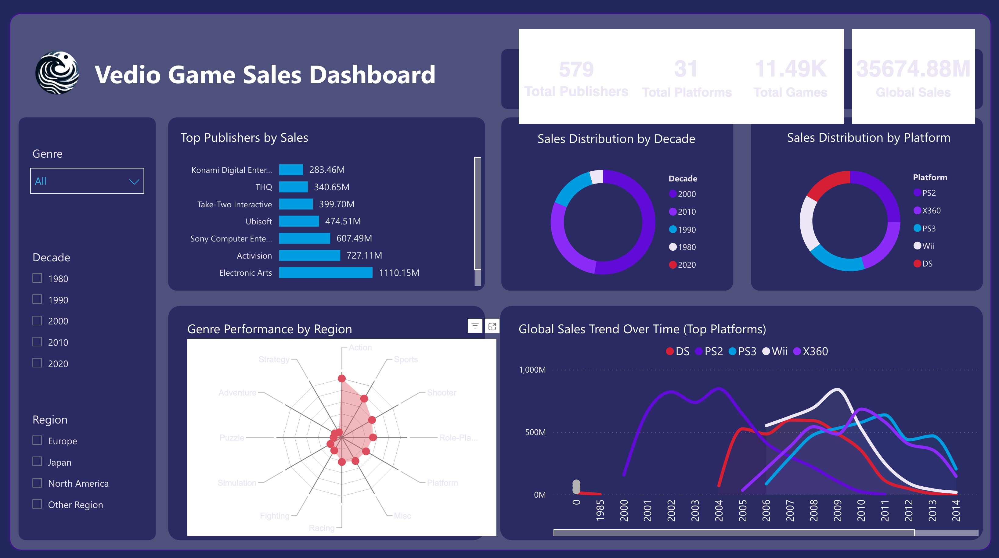

# 🎮 Video Game Sales Analytics Dashboard  
**AWS S3 → Athena → Power BI End-to-End Data Analytics Project**

---
## Live Dashboard

**Interactive Power BI Dashboard:**  
*(https://app.powerbi.com/view?r=eyJrIjoiZDk4OWQwOGMtMmRiOS00OWQzLThiZGMtNDc2MTc5NmEyNzI3IiwidCI6ImNiNzJjNTRlLTRhMzEtNGQ5ZS1iMTRhLTFlYTM2ZGZhYzk0YyIsImMiOjF9)*

## 📸 Dashboard Screenshots

### Full Dashboard Overview

## Project Overview

This project presents a full **cloud-based data analytics pipeline** that transforms raw video game sales data into an **interactive Power BI dashboard**.  
The workflow integrates **AWS cloud services, SQL-based querying, data validation and cleaning, and business intelligence visualization.**

The final dashboard enables users to explore **publisher dominance, platform lifecycle trends, regional performance, and genre-based insights** in a single interactive interface.

---

## Architecture Overview
Raw Data Files
↓
AWS S3 (Cloud Storage)
↓
Amazon Athena (Serverless SQL Query Engine)
↓
Simba Athena ODBC Connector
↓
Power BI Desktop / Power BI Service
↓
Interactive Business Dashboard

## Tech Stack

- **Cloud Storage:** AWS S3  
- **Query Engine:** Amazon Athena  
- **Connectivity:** Simba Athena ODBC Driver  
- **Data Processing:** SQL, Excel (VLOOKUP, data validation)  
- **Visualization:** Power BI  
- **Version Control:** GitHub  

## Connecting Athena to Power BI

- Connected **Amazon Athena** to **Power BI** using the **Simba Athena ODBC driver**.
- Enabled direct cloud-to-BI querying without intermediate data exports.
- Configured authentication, AWS region, and schema mapping to ensure stable connectivity.

## Data Validation Before Merging Tables

Before merging datasets, strict validation checks were performed to ensure data integrity:

- Verified column data types (numeric vs categorical)
- Standardized column names and formatting
- Validated join keys and removed duplicate records
- Eliminated inconsistent or invalid entries

## Data Cleaning & Enrichment (VLOOKUP)

- Used **VLOOKUP** to:
  - Match reference tables
  - Standardize publisher and platform names
  - Fill missing categorical values
- Removed unmatched rows after validation to maintain data consistency.

## SQL-Based Metric Extraction

- Aggregated metrics by **publisher, platform, region, genre, and decade** using SQL.
- Reduced downstream calculations inside Power BI.
- Produced analysis-ready datasets optimized for visualization.

## Power BI Dashboard Development

Built an interactive Power BI dashboard featuring:

- KPI cards summarizing overall market scale
- Top publishers ranked by global sales
- Sales distribution by decade and platform
- Global sales trends over time for major platforms
- Genre performance by region
- Interactive slicers for **Genre, Region, and Decade**

Query-level filters were applied to improve dashboard performance and responsiveness.

